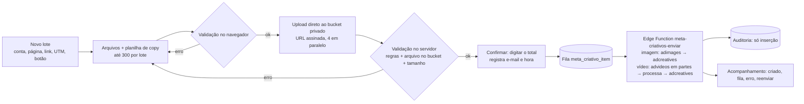

# Meta Ads: subida de criativos em massa

Tela: **Meta: subir criativos** (`/media/meta/criativos`).

Escopo: só **biblioteca de criativos**. A tela sobe imagem ou vídeo e cria o *adcreative* na conta. Ela **não cria anúncio, não ativa nada e não gasta verba**.

## Como funciona



| Proteção | Como |
|---|---|
| Quem pode usar | Login no Supabase (link por e-mail) **e** e-mail na lista `CRIATIVOS_EMAILS`. Sem a variável, ninguém usa. |
| Token do Meta | Fica só no banco e na Edge Function. Nunca vai ao navegador nem à auditoria. |
| Erros de digitação | Validação de formato, tamanho, largura, proporção, textos, botão permitido, link só `https` do domínio da Soldiers, `url_tags` no formato certo, nome e arquivo repetidos. |
| Confirmação | Só lote 100% válido. É preciso digitar o número exato de criativos. Fica registrado quem confirmou. |
| Repetição | Cada passo (image_hash, video_id, creative_id) é salvo antes do próximo, então reenviar não duplica nada no Meta. O mesmo arquivo não entra duas vezes no lote (sha256). |
| Limite de uso da API | Lê `x-business-use-case-usage`, espera quando o uso passa de 90% e reagenda em erros de limite (espera crescente até 30 min). Desiste depois de 8 tentativas. |
| Token vencido ou sem permissão | O executor para tudo e registra `executor_parado` na auditoria. A tela avisa quando o token não tem `ads_management`. |
| Rastro | `meta_criativo_auditoria` não aceita UPDATE nem DELETE (trigger). |
| Banco | RLS ligado nas três tabelas, sem acesso para `anon`/`authenticated`. Só o servidor lê e escreve. |

## Ligar (passo a passo)

1. **Banco:** aplique `supabase/migrations/20261003120000_meta_criativos_em_massa.sql` (SQL editor ou `supabase db push`). Isso cria:
   - 3 tabelas;
   - 3 funções;
   - o bucket privado `meta-criativos`.

   Nenhuma tabela existente é alterada.
2. **Login:**
   - Em Supabase → Authentication, deixe o provedor **Email** ligado (link mágico).
   - Inclua a URL do app em *Redirect URLs*.
3. **Edge Function:** `supabase functions deploy meta-criativos-enviar --no-verify-jwt`. Em Secrets, configure:
   - `CRIATIVOS_FUNCTION_SECRET`: um segredo longo;
   - `META_GRAPH_VERSION`: a versão vigente da Graph API.
4. **App (Lovable → variáveis de ambiente do servidor):**
   - `CRIATIVOS_EMAILS=malu@soldiersnutrition.com.br,...`
   - `CRIATIVOS_FUNCTION_SECRET`: o mesmo segredo do passo 3.
5. **Agendamento (recomendado):**
   - habilite `pg_cron` e `pg_net`;
   - rode o bloco comentado no fim da migração, trocando `<PROJETO>` e `<SEGREDO>`.

   Assim a fila anda a cada minuto, mesmo se a pessoa fechar a tela.
6. **Token:** o token em `meta_credentials` precisa da permissão `ads_management`. Hoje o app usa o token só para leitura.
7. **Primeiro teste:** faça um lote com 2 imagens e 1 vídeo curto. Confira os criativos na biblioteca do Gerenciador de Anúncios antes de subir lotes grandes.

## Planilha de copy (opcional)

CSV com cabeçalho, separador `,` ou `;`. As linhas casam com os arquivos pelo nome do arquivo.

```
arquivo;nome;texto;titulo;descricao;cta;link;url_tags
creatina_ugc_01.mp4;BF_CREATINA_UGC_01;Creatina pura, 300g;Creatina Soldiers;;SHOP_NOW;https://www.soldiersnutrition.com.br/products/creatina;utm_source=meta&utm_medium=paid&utm_campaign=bf
```

Botões aceitos: `SHOP_NOW`, `BUY_NOW`, `ORDER_NOW`, `LEARN_MORE`, `GET_OFFER`, `SIGN_UP`, `SUBSCRIBE`.

## Limites desta versão

- **Arquivos:** até 300 criativos por lote, imagem até 30 MB e vídeo até 200 MB. O limite de vídeo é do executor, não do Meta.
- **Capa de vídeo:** opcional. Sem capa, usa a imagem que o Meta gera ao processar o vídeo.
- **Instagram:** o campo de identidade do Instagram no criativo (`instagram_user_id`) e os códigos de erro de limite estão marcados para conferir na referência da Marketing API antes de ligar.
- **Anúncios:** criar anúncios a partir dos criativos fica para a próxima fase, com aprovação.
